  

  

 

---

## Current Work

### Figma → Jira / Wiki Automation
LLM + Figma MCP + API integration that auto-generates Jira tickets and technical wiki docs directly from design context. Owned end-to-end: product definition, stakeholder alignment with PMs and Scrum Masters, and engineering execution. Eliminates manual documentation labor across the org.

### Copilot ROI Dashboard
Real-time benchmarks, AI adoption trends, team-level analysis, and ROI calculator — giving CTOs and engineering managers visibility into what AI enablement is actually delivering. Built to make the business case for AI investment legible at the executive level.

### QA Test Case Automation
Automated test case generation pipeline via Storybook and MCP servers. Reduces manual QA effort while maintaining quality standards team-wide.

### AI Learning Series *(Internal)*
Created and led an org-wide curriculum covering MCP workflows, Skills, IDE optimization, and AI-augmented engineering practices. The human infrastructure that makes AI adoption actually stick.

---

## How I Lead

- Manage cross-functional engineering teams (engineers, QA, design, scrum)
- Own product roadmaps and sprint planning end-to-end
- Translate ambiguous business requirements into clear technical direction
- Run scrum ceremonies: standups, sprint planning, retrospectives, stakeholder demos
- Build AI adoption strategies and measure ROI for executive audiences
- Create the tooling and documentation systems that outlast individuals

I combine engineering depth with product ownership — the combination that lets me hold both the technical vision and the business outcome at the same time.

---

## How I Work

- Creating structure around ambiguous requirements
- Translating product goals into clear technical direction
- Building automated tools that replace repetitive work
- Designing scalable component and layout systems
- Strengthening communication between product, design, and engineering
- Ensuring teams have the context and clarity they need to execute well

---

## Technologies

| | |
|---|---|
| **AI & LLM** | MCP Servers, LLM Integration, Claude Code, CoPilot, Figma MCP, Storybook Automation, Agentic Workflows, DataIku |
| **Languages** | JavaScript, TypeScript, Node.js / NestJS, React, Angular, PHP, Python, C++, Swift, Java |
| **Infrastructure** | AWS, Docker, Vercel, Cloudflare, Supabase, Linux/UNIX, Git, GitHub Actions, CI/CD |
| **Databases** | MongoDB, MySQL, MSSQL, Snowflake, Redis |
| **Tools** | Figma, Jira, Confluence, AEM, Miro, VS Code, Bitbucket |

---

## Experience Summary

- Lead cross-functional engineering teams as Engineering Manager and Product Owner
- Architect and ship AI-powered internal tools and automation pipelines
- Build MCP integrations and LLM workflows for enterprise engineering orgs
- Manage product roadmaps, sprint planning, and cross-functional stakeholder alignment
- Modernize legacy codebases, dispatchers, and front-end platforms
- Present ROI analysis and AI enablement metrics to CTO-level audiences

My path started with early HTML/CSS experiments, moved through a Computer Science degree at Sonoma State University, and grew through roles at UC Davis and Madison Logic — building internal tools, systemizing documentation, and modernizing large marketing engineering platforms. Now at Solidigm, I lead engineering initiatives at the intersection of AI, product, and people.

---

## What I'm Exploring

- Agentic engineering workflows that give teams AI leverage at the task level
- Design → engineering automation at organizational scale
- Better documentation systems for teams working across product and design
- Scalable AI adoption frameworks for large engineering orgs

---

*If your work sits at the intersection of AI tooling, engineering leadership, or product ownership — I'm always open to conversations.*

📧 1426davejobs@gmail.com · [LinkedIn](https://linkedin.com/in/codingforgood) · [Portfolio](https://smithdavedesign.herokuapp.com)
